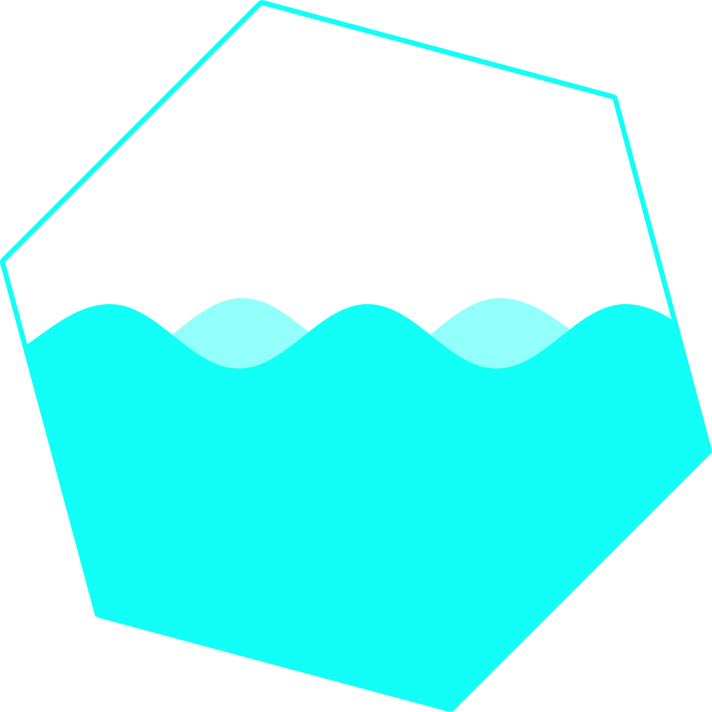

<p align="center">
  
</p>
<h1 align="center">Shipwreck</h1>
<h4 align="center">Automatically create Crystal JSON mappings from input</h4>
<p align="center">
  <br />
    <a href="https://github.com/GeopJr/Shipwreck/blob/main/CODE_OF_CONDUCT.md"></a>
</p>

#

<p align="center">
    
</p>

#

## Use

- Go to https://shipwreck.geopjr.dev/
- Input your (complex or not) JSON in the textarea labeled as "Input"
- Copy the generated Crystal code from the textarea labeled as "Output"
- (Optional) Test the output on carc.in by clicking the button labelled as such

#

## Warnings

- By clicking the button labelled as "Run on carc.in" you are sending the input to it. Please redact any sensitive information before doing so.
- JSONs with array as root won't work as it's outside the scope of this tool.
- Nothing is nullable by default.
- All Ints and Floats are 64 bit by default.
- Keys that are not valid Crystal variables (eg. starting with `-` or a number) will get assigned a random name.

#

## Optimization

Optiomization recursively removes unnecessary structs untill there's nothing else to do. While this makes the output smaller, it also makes the structs unmaintainable.

Eg. The following JSON...

```json
{ "person": { "name": "Ciel", "height": 154.52 }, "cat": { "name": "Sakamoto", "height": 0.25 } }
```

...would generate two structs, one for the `person` and one for the `cat`. But with optimization on, they will use the same struct since their keys & the types of their values are the same. But if the `person` gets a `weight` key but `cat` doesn't, a new struct just for the `person` needs to get generated. Having two seperate structs, in this case, would make adding a key easy.

While the above example uses a simple JSON, Shipwreck should be able to handle complex & nested objects (even if inside arrays!).

#

## Contributing

1. Read the [Code of Conduct](https://github.com/GeopJr/Shipwreck/blob/main/CODE_OF_CONDUCT.md)
2. Fork it ( https://github.com/GeopJr/Shipwreck/fork )
3. Create your feature branch (git checkout -b my-new-feature)
4. Commit your changes (git commit -am 'Add some feature')
5. Push to the branch (git push origin my-new-feature)
6. Create a new Pull Request
